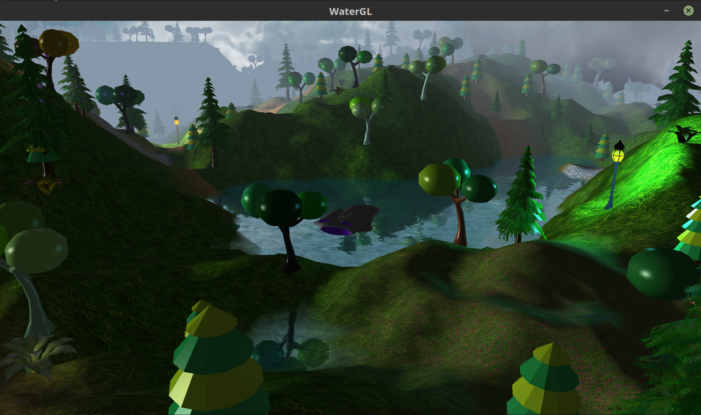
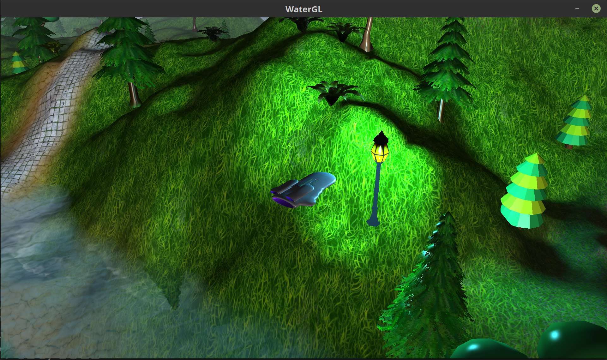
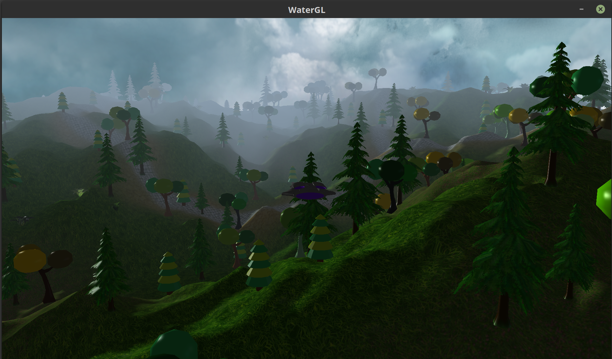
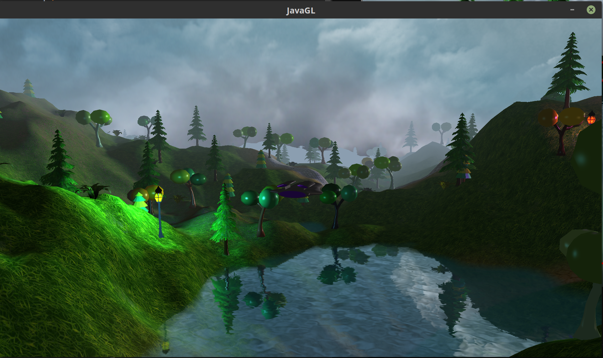
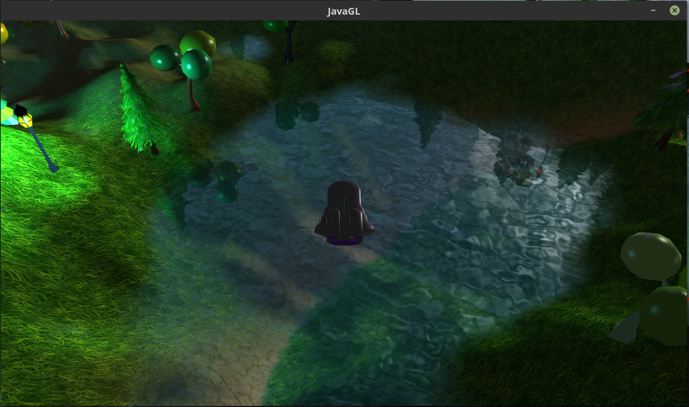
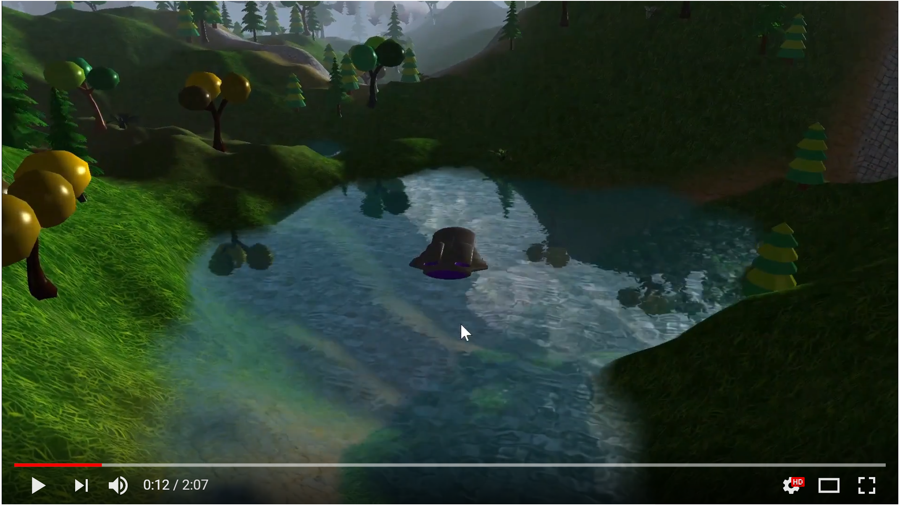

# paradise-gl
Computer Graphics Final Project - Paradise: Forest and Water Simulation.

## Setup Instructions
* Add the JARs under lib/jars to your project's libraries. This includes LWJGL, SlickUtils and PNGDecoder.
* Add `-Djava.library.path=lib/natives/` to your JVM options while building.
* **IMPORTANT** - The native link libraries included are for Linux distributions.
For other platforms, you'll need to download them separately from [here](https://sourceforge.net/projects/java-game-lib/files/Official%20Releases/LWJGL%202.9.3/).
* If you have any trouble running this, shoot me an [email](mailto:chatt086@umn.edu).

## Snapshots

##### Nature's Beauty

Just an aesthetic shot of our scene.

##### Fake Lighting(Lamp) & Transparent Textures (Pine, Fern)

* We can fully see through parts of the Fern's and Pine's leaves.
* We've lit up the lamp as if it were the source of the light.

##### Fogging, Skybox, Multi-Textured Terrain, Texture Atlases (Bob, Fern)

* Distant trees and plateaus appear hazed in the fog.
* The cloudy sky spans all over the forest.
* The terrain has multiple surfaces - grassy, dirt, path, flower patches.
* There are trees and ferns with different colors.

##### Water Reflections - Fresnel Effect

More reflection if you view the water from the side.

##### Water Refractions - Fresnel Effect

More refraction through the water surface if you see it from the top.

## SIMULATION VIDEO

## CONTROLS

| Input | Action |
|:----|--------:|
| W | Move Forward |
| S | Move Backward |
| A | Turn Left |
| D | Turn Right |
| Q | Move Upward |
| E | Move Downward |
| F | Toggle Full Screen |
| Space | x3 Boost Move Speed |
| Mouse Wheel | Zoom In/Out |
| Mouse Left Click & Drag | Rotate Camera |
| Mouse Right Click | Restore Camera |

## Objective
The aim of the project is to render a simulation of a scene consisting of a forest containing a lake using the modern OpenGL pipeline.

## Group Members
* Debojeet Chatterjee
* Ameya Gurjar

## Project Description
We're using the Light-Weight Java Game Library for this project to try out a different style of OpenGL programming and also, since using Java allows us to package and structure a larger codebase more easily in a purely Object Oriented manner.
In this project, you navigate your ship in 3rd-Person through a beautiful hilly forest area full of different kinds of trees, ferns, lamps and a lake.

### Forest Simulation
* We have supported **Transparent Textures** to render ferns and pine trees to let us completely see through areas where the alpha of the texture is less than 0.5
* We're also mixing between the sky colour and the terrain as well as model texture color to haze distant models and terrains exponentially to achieve a fogging effect.
* In addition, we are **Multi-Texturing** the terrain using a **Blend Map** to blend between 4 different textures based on the R, G, B components.
* We’ve added a **Skybox** using a GLSL samplerCube that moves with the player for realism. 
* We’ve used **Texture Atlases** for some models so that we can re-use the same model with different looks using only one texture file.
* We’ve used a **Height Map** to make the terrain uneven with hills and troughs.

### Water Simulation
* The water body is simply a flat **quad** made up of two triangles.
* The quad is textured so that it looks like a water body. A combination of reflection texture and refraction texture is used. This makes use of **Frame Buffer Objects**.
* Both textures need to be clipped using a **Clipping Plane** at the height of the water surface quad to only render what is necessary.
* **Projective Texturing** is used to texture the water surface to make the water reflect and refract based on the position of the camera relative to the water.
* The two textures are mixed using the **Fresnel Effect**. This is achieved by the simple formula for refractivity = max(dot(water_normal, view_direction), 0). A higher value results in less reflectivity.
* To make it look like the water is rippling, we add some distortion to the surface of the water according to a **DuDv Map**. We also change the distortion with respect to time for realistic effect.
* A **Normal Map** that corresponds to the DuDv map is used for uneven specular highlights on the surface of the water based on the ripples.

## Challenges Faced:
* To avoid player-terrain collision as we didn’t want the player to collide with the terrain and go through it,
we added checks to make sure the player’s ship is always some distance above the terrain. This was trickier when we added the water surface but we used a similar technique for a buoyant effect.
* To ensure that none of the randomly generated entities were rendered on the water surface. We wrote a function to determine if a particular position vec3 is underwater. This came into use in the above problem as well.
* We wanted to **randomly generate** and place a large amount of foliage on the map. For this, we used an optimised approach to load a multitude of instanced entities by loading their corresponding textures only once before rendering them.
* **Fake Lighting** i.e setting all object normals to point upward lets us light up the lamp and nearby area realistically with just an overhead point light.
* To make the distortion in the water look realistic. For this we sampled the DuDv map multiple times and each time we changed the offset in a different way and combined their effects so that the distortion in the water would look natural.
* Finally, as a by-product of the distortion we add in the water, we get some glitches on the edges of the water body. We make use of the refraction depth texture and soften the edges of the water surface using **Alpha Blending**.

## Connections to Class:
Even though our goal here was to learn a lot of concepts outside of our class curriculum through implementation, we did use
a number of concepts that we were taught in class.
* We used the **Fresnel Effect** in rendering the surface of the water naturally. The reflectance of the water changes according to the viewing direction.
* We’ve added a time-based distortion to the surface of the water which is related to **time-based animation**.
* The edges of the water surface are soft which is implemented using **Alpha Blending** and transparency.
* Using the **Graphics Pipeline**(model, view, projection matrices).
* Using point lights which uses the concept of **Local Illumination** with three term quadratic falloff.
* We use the **Phong Lighting Model** with Blinn-Phong specular highlights to light up our entire scene.

## Future Enhancements

* **Audio** Effects.
* Entity **Collision** with Player.
* **Particle Effects** for flowing water, fountains, waterfalls and other natural phenomenon.
* **Deferred Rendering** could let us include a lot more lamps and let us have a beautiful Night scene.
* **Shadow Maps** and **Entity Normal Maps**.